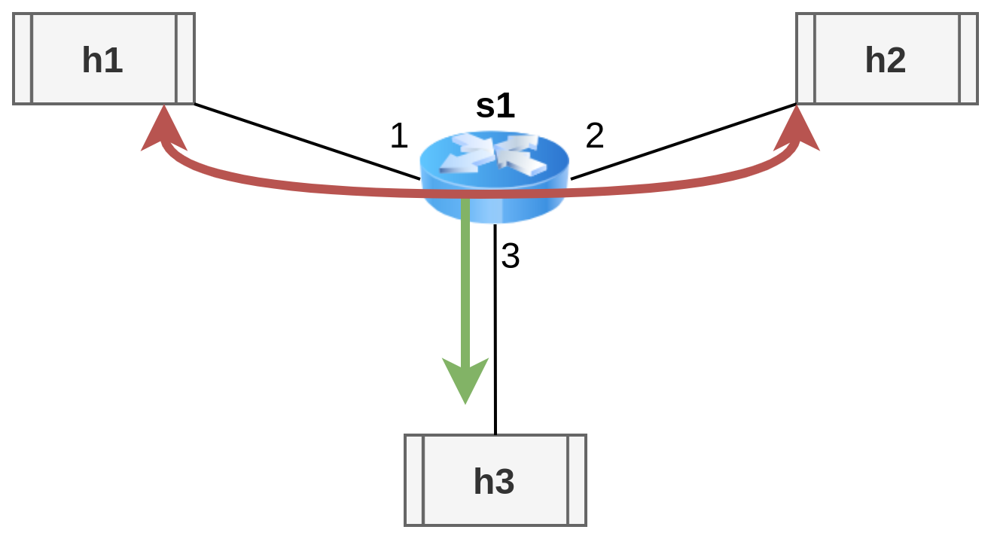

# Simple network with egress 2 egress cloning
A 3 hosts, 1 switch network that clones every packet exchanged between h1 and h2 to h3. The clone happens between the ingress and egress queue.
 

**Host IPs are numbered from 10.0.0.1 to 10.0.0.3 from h1 to h3.**

# How to run it
First open 2 terminals in clone_example/basic_e2e.

In the **first terminal** run the following commands, to:
1. generate a JSON file with the description of the basic_e2e.p4 rules
2. start the topography described in test_topo.py
3. open a terminal for every node - we will call them h1, h2 and h3 
```shell
p4c-bm2-ss --p4v 16 basic.p4 -o basic.json
sudo python start_test_topo.py
xterm h1 h2 h3
```

In the **second terminal** run the following command to add the rules written in cmd.txt to the switch s1, that enable forwarding between h1 and h2 with the clone to h3:
```shell
sudo python cmd_add.py
```

Then, in the **h2 and h3 terminals**, run the following command to start listening to TCP packets:
```shell
./receive.py
```

Then, in the **h1 terminal** run the following command to send a packet to h2:
```shell
./send.py 10.0.0.2 "message payload"
```

**If h3 receives the message then the clone was successfully performed**
