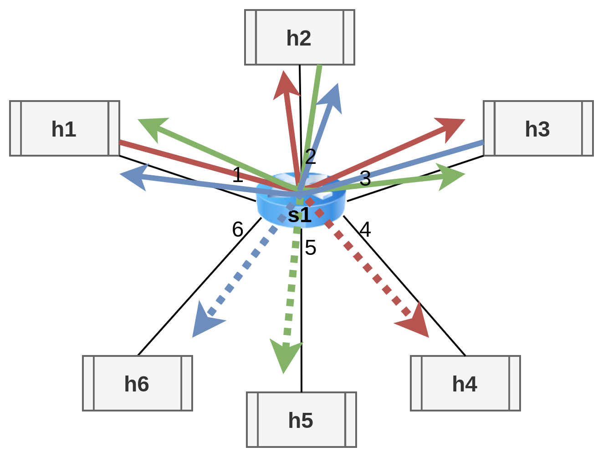

# Multiple cloning based on the source address
A 6 hosts, 1 switch network that clones every packet exchanged coming from h1 to h4, from h2 to h5 and from h3 to h6.
 

**Host IPs are numbered from 10.0.0.1 to 10.0.0.6 from h1 to h6.**

# How to run it
First open 2 terminals in clone_example/clone_multiple_mirroring.

In the **first terminal** run the following commands, to:
1. generate a JSON file with the description of the clone_multiple_mirroring.p4 rules
2. start the topography described in test_topo.py
3. open a terminal for every node - we will call them h1, h2, h3, h4, h5 and h6
```shell
p4c-bm2-ss --p4v 16 clone_multiple_mirroring.p4 -o basic.json
sudo python start_test_topo.py
xterm h1 h2 h3 h4 h5 h6
```

In the **second terminal** run the following command to add the rules written in cmd.txt to the switch s1, that enables multiple cloning (from h1 to h4, from h2 to h5, from h3 to h6):
```shell
sudo python cmd_add.py
```

## Step 1

Then, in the **h2, h3, h4 and h5 terminals**, run the following command to start listening to TCP packets:
```shell
./receive.py
```

Then, in the **h1 terminal** run the following command to send a packet to h2:
```shell
./send.py 10.0.0.2 "message payload"
```

Then, in the **h1 terminal** run the following command to send a packet to h3:
```shell
./send.py 10.0.0.3 "message payload"
```

**If h4 receives the message (but not h5 and h6) then the clone was successfully performed**

## Step 2

Then, in the **h1, h3, h4 and h5 terminals**, run the following command to start listening to TCP packets:
```shell
./receive.py
```

Then, in the **h2 terminal** run the following command to send a packet to h1:
```shell
./send.py 10.0.0.1 "message payload"
```

Then, in the **h2 terminal** run the following command to send a packet to h3:
```shell
./send.py 10.0.0.3 "message payload"
```

**If h5 receives the message (but not h4 and h6) then the clone was successfully performed**

## Step 3

Then, in the **h1, h2, h4 and h5 terminals**, run the following command to start listening to TCP packets:
```shell
./receive.py
```

Then, in the **h3 terminal** run the following command to send a packet to h1:
```shell
./send.py 10.0.0.1 "message payload"
```

Then, in the **h3 terminal** run the following command to send a packet to h2:
```shell
./send.py 10.0.0.2 "message payload"
```

**If h6 receives the message (but not h4 and h5) then the clone was successfully performed**
