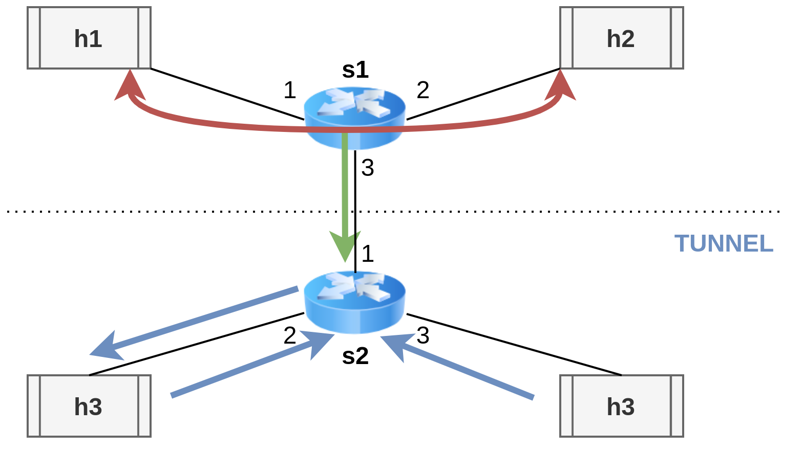

# Ingress 2 egress cloning and packet tunneling
A 4 hosts, 2 switch network that clones every packet exchanged between h1 and h2 to h3 with the help of a tunneling rule. Packets exchanged between h3 and h4 are tunneled to h3 as well.
 

# How to run it
First open 2 terminals in clone_example/basic.

In the **first terminal** run the following commands, to:
1. generate a JSON file with the description of the basic.p4 rules
2. start the topography described in test_topo.py
3. open a terminal for every node - we will call them h1, h2 and h3 
```shell
p4c-bm2-ss --p4v 16 basic.p4 -o basic.json
sudo python start_test_topo.py
xterm h1 h2 h3
```

In the **second terminal** run the following command to add the rules written in cmd.txt to the switch s1:
```shell
sudo python cmd_app.py
```

Then, in the **h2 and h3 terminals**, run the command to start listening to TCP packets:
```shell
./receive.py
```

Then, in the **h1 terminal** run the command to send a packet to h2:
```shell
./send.py 10.0.0.2 "message payload"
```

**If h3 receives the message then the clone was successfully performed**


**********************STEP 1 - CONTROLLO CLONAGGIO***********************
Aprire 2 terminali dentro la cartella clone_examples
I terminale: p4c-bm2-ss --p4v 16 basic.p4 -o basic.json
I terminale: sudo python start_test_topo.py
I terminale: xterm h1 h2 h3 h4
II terminale: sudo python cmd_add.py
h1: ./send.py 10.0.0.2 "message payload"
h3 e h4: ./receive.py

VERIFICARE CHE h3 riceva il messaggio, ma non h4

**********************STEP 2 - CONTROLLO TUNNELING***********************
I terminale: xterm h3 (per aprire nuovo terminale in cui controllare messaggi tunneled a h3)
h3(2) e h4: ./receive.py
h3: ./send.py 10.0.0.4 "message payload"

CONTROLLARE CHE h3(2) riceva il messaggio tunneled su se stesso
