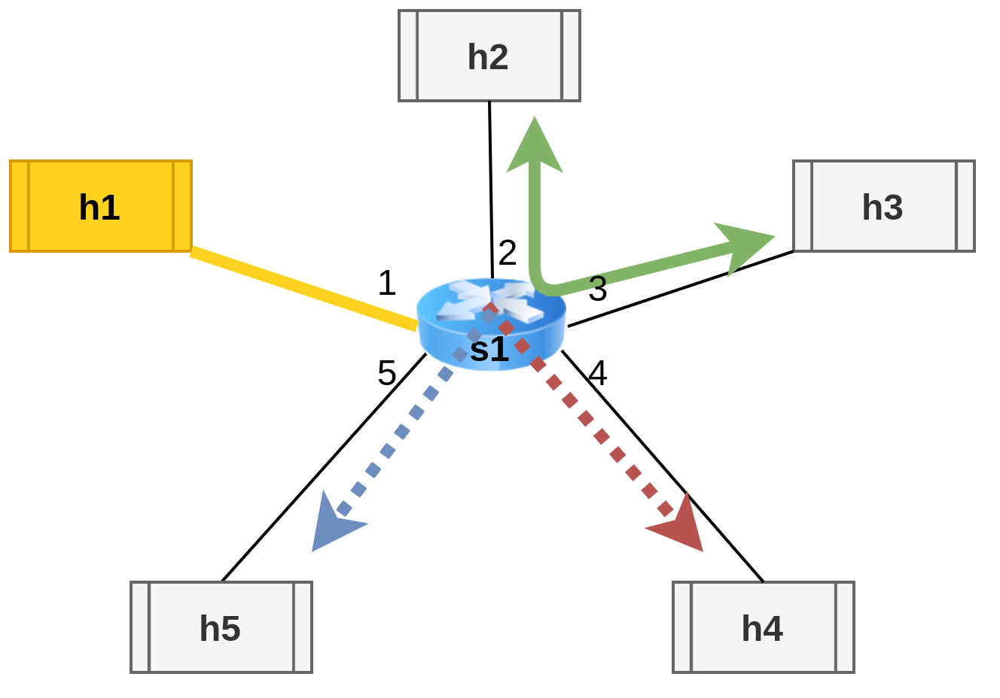

# Programmable cloning
A 5 hosts, 1 switch network in which host1 sets which cloning channel is enabled at the moment.
 

**Host IPs are numbered from 10.0.0.1 to 10.0.0.5 from h1 to h5.**

# How to run it
First open 2 terminals in clone_example/dynamic_fw.

In the **first terminal** run the following commands, to:
1. generate a JSON file with the description of the basic.p4 rules
2. start the topography described in test_topo.py
3. open a terminal for every node - we will call them h1, h2, h3, h4 and h5
```shell
p4c-bm2-ss --p4v 16 basic.p4 -o basic.json
sudo python start_test_topo.py
xterm h1 h2 h3 h4 h5
```

In the **second terminal** run the following command to add the rules written in cmd.txt to the switch s1, that enables multiple cloning (to h4 and h5):
```shell
sudo python cmd_add.py
```

## Step 1

Then, in the **h3, h4 and h5 terminals**, run the following command to start listening to TCP packets:
```shell
./receive.py
```

Then, in the **h2 terminal** run the following command to send a packet to h3:
```shell
./send.py 10.0.0.3 "message payload"
```
**Verify that only h3 receives the packet**

Then, in the **h1 terminal** run the following command to program s1 to clone packets to h4:
```shell
./program.py 2
```
Then, in the **h2 terminal** run the following command to send a packet to h3:
```shell
./send.py 10.0.0.3 "message payload"
```

**If only h3 and h4 receive the packet then the switch was successfully programmed to only clone to h4**

## Step 2

Then, in the **h1 terminal** run the following command to program s1 to clone packets to h5:
```shell
./program.py 3
```
Then, in the **h2 terminal** run the following command to send a packet to h3:
```shell
./send.py 10.0.0.3 "message payload"
```

**If only h3 and h5 receive the packet then the switch was successfully programmed to only clone to h5**

## Demo
A little demo to show how this example works:
[](https://www.youtube.com/watch?v=urRwQFGjCvw)
